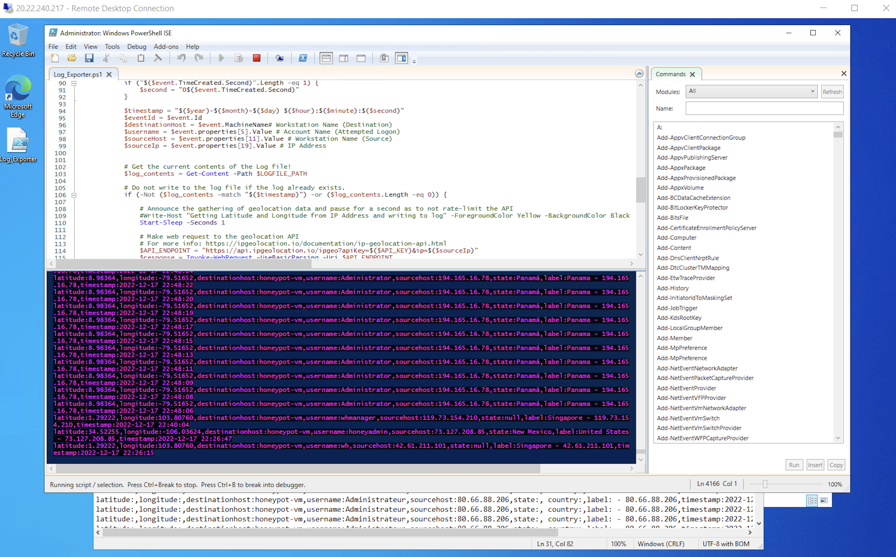

# Microsoft Sentinel SIEM & Honeypot | Live Cyber Attack Dashboard

## Table of Contents

1. [Summary](#summary)
2. [Learning Objectives](#learning-objectives)
3. [Tools & Requirements](#tools--requirements)
4. [Overview](#overview)
5. [Step-by-Step Guide](#step-by-step-guide)
   - [Step 1: Create a Microsoft Azure Subscription](#step-1-create-a-microsoft-azure-subscription)
   - [Step 2: Create a Honeypot Virtual Machine](#step-2-create-a-honeypot-virtual-machine)
     - [Basics](#basics)
     - [Project Details](#project-details)
     - [Instance Details](#instance-details)
     - [Administrator Account](#administrator-account)
     - [Inbound Port Rules](#inbound-port-rules)
     - [Licensing](#licensing)
     - [Disks](#disks)
     - [Networking](#networking)
       - [Network Interface](#network-interface)
   - [Step 3: Create a Log Analytics Workspace](#step-3-create-a-log-analytics-workspace)
   - [Step 4: Configure Microsoft Defender for Cloud](#step-4-configure-microsoft-defender-for-cloud)
     - [Settings | Defender Plans](#settings--defender-plans)
     - [Settings | Data Collection](#settings--data-collection)
   - [Step 5: Connect Log Analytics Workspace to Virtual Machine](#step-5-connect-log-analytics-workspace-to-virtual-machine)
   - [Step 6: Configure Microsoft Sentinel](#step-6-configure-microsoft-sentinel)
   - [Step 7: Disable the Firewall in Virtual Machine](#step-7-disable-the-firewall-in-virtual-machine)
   - [Step 8: Scripting the Security Log Exporter](#step-8-scripting-the-security-log-exporter)
   - [Step 9: Create Custom Log in Log Analytics Workspace](#step-9-create-custom-log-in-log-analytics-workspace)
   - [Step 10: Query the Custom Log](#step-10-query-the-custom-log)
   - [Step 11: Extract Fields from Custom Log](#step-11-extract-fields-from-custom-log)
   - [Step 12: Map Data in Microsoft Sentinel](#step-12-map-data-in-microsoft-sentinel)
   - [Step 13: Deprovision Resources](#step-13-deprovision-resources)


### Summary
SIEM (Security Information and Event Management) is an essential solution for organizations aiming to proactively detect, analyze, and respond to security threats. This system collects and correlates event log data across various sources, including firewalls, IDS/IPS, and identity management solutions, enabling security professionals to monitor, prioritize, and address potential threats in real-time.

A honeypot complements SIEM by acting as a decoy, setting up a controlled and secure environment to attract attackers. This method not only diverts attention from real assets but also provides invaluable insights into attack strategies and helps improve security measures.

This project focuses on utilizing Azure Sentinel to orchestrate these components effectively. It includes a practical lab setup where honeypot attack data is gathered, analyzed through SIEM capabilities, and visualized on a global map by event count and geographic location. The goal is to provide a user-friendly interface for real-time security threat visualization and analysis, enhancing both understanding and responsiveness to cyber threats.

### Learning Objectives:
- **Configure and Deploy Azure Resources**: Set up essential components like Virtual Machines, Log Analytics Workspaces, and Azure Sentinel.
- **Gain Hands-On SIEM Experience**: Develop practical skills with Microsoft's Azure Sentinel.
- **Analyze Windows Security Event Logs**: Acquire knowledge in handling and interpreting these logs.
- **Utilize KQL for Data Queries**: Master Kusto Query Language (KQL) to effectively query log data.
- **Visualize Attack Data**: Use Azure Workbooks to create dynamic world-map visualizations of attack data.

### Tools & Requirements:

1. **Microsoft Azure Subscription**: Required for accessing cloud-based resources and services.
2. **Azure Sentinel**: Key to our SIEM setup for detecting and responding to security threats in real-time.
3. **Kusto Query Language (KQL)**: Used for building complex queries to visualize attack patterns.
4. **Network Security Groups**: Manage firewall configurations at Layer 3/4 in Azure.
5. **Remote Desktop Protocol (RDP)**: Essential for remote management of virtual machines.
6. **3rd Party API**: [ipgeolocation.io](https://ipgeolocation.io/) - Provides geographical data for enhancing log information.
7. **Custom PowerShell Script**: Authored by Josh Madakor. [View script](https://github.com/joshmadakor1/Sentinel-Lab/blob/main/Custom_Security_Log_Exporter.ps1).


### Overview:


## Step 1: Create a Microsoft Azure Subscription
> Sign up and get a free $200 credit for the first 30 days. Ensure you have all necessary information ready for setting up the account.
[Azure Free Account](https://azure.microsoft.com/en-us/free/)


## Step 2: Create a Honeypot Virtual Machine
> Set up an exposed Windows VM to act as a honeypot.


### Basics
- **Navigate**: Go to [Azure Portal](https://portal.azure.com)
- **Search**: Type "virtual machines" in the search bar.
- **Create**: Choose 'Azure virtual machine'.

#### Project Details
- **Resource Group**: Create a new resource group and name it `honeypotlab`.
  > A resource group is a collection of resources that share the same lifecycle, permissions, and policies.

#### Instance Details
- **Name**: Name your VM `honeypot-vm`.
- **Region**: Select the recommended region (e.g., (US) East US 2).
- **Availability**: No infrastructure redundancy required.
- **Security Type**: Standard.
- **Operating System**: Windows 10 Pro, version 21H2 - x64 Gen2.
- **Size**: Standard_D2s_v3 (2 vCPUs, 8 GiB memory) is sufficient.

#### Administrator Account
- **Credentials**: Create a username and password.
  > **IMPORTANT**: These credentials will be used to log into the virtual machine. Keep them secure and accessible.

#### Inbound Port Rules
- **RDP Access**: Allow RDP (3389) to enable remote desktop access.

### Licensing
Confirm licensing terms, then select **Next: Disks >** to proceed to configuring storage options.


### Disks
- **Defaults**: Leave all disk configurations as default.
- **Navigation**: Select **Next: Networking >** to configure network settings.

### Networking
#### Network Interface
- **Network Security Group Settings**: Choose 'Advanced' and create a new group.
  - **Security Rule Management**: This group manages security rules that allow or deny traffic to/from the VM.
- **Modify Inbound Rules**: Remove the default 'Allow RDP' rule.
- **Add Inbound Rule**:
  - **Destination Port Ranges**: * (Accept all ports)
  - **Protocol**: Any
  - **Action**: Allow
  - **Priority**: 100 (Lowest priority)
  - **Rule Name**: Specify as needed (e.g., ALLOW_ALL_INBOUND)
- **Review Setup**: Confirm settings and select **Review + create**.

> **Caution**: Configuring the firewall to allow traffic from all sources can make the VM highly visible and vulnerable.


## Step 3: Create a Log Analytics Workspace
- **Setup**:
  - Navigate to 'Log Analytics Workspaces' and select **Create**.
  - Use the same resource group as the VM for easy management.
  - **Workspace Name**: Enter a meaningful name (e.g., honeypot-log).
  - **Region**: Choose the same region as the VM to optimize data management.
- **Review**: Double-check settings and select **Review + create**.

> This setup ensures that both Windows Event Viewer logs and custom logs with geographical data are collected, providing insights into attacker locations and behaviors.


## Step 4: Configure Microsoft Defender for Cloud
Navigate to **Microsoft Defender for Cloud** via the search function:
- **Location**: Go to "Environment settings" > [Your Subscription Name] > [Log Analytics Workspace Name] (log-honeypot).


#### Settings | Defender Plans
Configure the following options:
- **Cloud Security Posture Management**: Enable this feature.
- **Servers**: Enable monitoring.
- **SQL Servers on Machines**: Disable this feature for now.
- **Action**: Click **Save** to apply the settings.


#### Settings | Data Collection
- **Data Collection Level**: Ensure "All Events" is selected to capture comprehensive data.
- **Save Changes**: Click **Save**.

## Step 5: Connect Log Analytics Workspace to Virtual Machine
To link your VM with the analytics tools:
- **Workspace Navigation**: Go to "Log Analytics Workspaces", select your workspace (log-honeypot).
- **VM Connection**: Navigate to "Virtual Machines", find and select your VM (honeypot-vm).
- **Connect**: Click on **Connect** to establish the link.


## Step 6: Configure Microsoft Sentinel
Set up Sentinel for advanced security analytics:
- **Access Sentinel**: Search for "Microsoft Sentinel" and select **Create Microsoft Sentinel**.
- **Workspace Selection**: Choose the Log Analytics workspace (honeypot-log) previously configured.
- **Integration**: Click **Add** to integrate Sentinel with your workspace.


## Step 7: Disable the Firewall in Virtual Machine
Navigate to your virtual machines:
- **VM Selection**: Locate your honeypot VM (honeypot-vm).
- **Remote Desktop**: Use the IP from the VM to connect via RDP with the credentials set earlier.
- **Firewall Configuration**: Disable the firewall by searching for `wf.msc`:
  - Set the Firewall State to OFF for **Domain Profile**, **Private Profile**, and **Public Profile**.
  - Confirm changes with **Apply** and **OK**.
- **Connectivity Test**: Ensure the VM is reachable by pinging from your host machine's command line: `ping -t <VM IP>`.


## Step 8: Scripting the Security Log Exporter
- Open PowerShell ISE in the VM and set up Edge without signing in.
- Download and copy the [Powershell script by Josh Madakor](https://github.com/joshmadakor1/Sentinel-Lab/blob/main/Custom_Security_Log_Exporter.ps1) into the VM's PowerShell environment.
- Select **New Script** in PowerShell ISE, paste the script, and save it on the Desktop as `Log_Exporter.ps1`.


- Register for a free account at [IP Geolocation API](https://ipgeolocation.io/) which provides 1,000 API calls per day for free. The paid plan allows up to 150,000 API calls per month for $15.00.
- Copy the API key from your account and insert it into the script on line 2: `$API_KEY = "<API key>"`
- Save the changes and execute the script in the VM by pressing the **Green play button** to begin continuous log data generation.


> The script will export data from Windows Event Viewer, integrate with the IP Geolocation service, extract latitude and longitude, and create a new log file named `failed_rdp.log` at `C:\ProgramData\failed_rdp.log`.

## Step 9: Create Custom Log in Log Analytics Workspace
- Create a custom log to integrate the data from the IP Geolocation service into Azure Sentinel.
- In the VM, open the Run dialog, type `C:\ProgramData`, and locate the file named `failed_rdp`.
- Select all content with **CTRL + A** and copy it with **CTRL + C**.
- Open Notepad on your host PC, paste the contents, and save the file on the Desktop as `failed_rdp.log`.
- In Azure, navigate to Log Analytics Workspaces, select your workspace (honeypot-log), and go to Custom logs > **Add custom log**.
  #### Sample
  - Choose the `failed_rdp.log` file you saved earlier and click **Next**.
  #### Record delimiter
  - Verify the log format in the Record delimiter section and proceed by clicking **Next**.
  #### Collection paths
  - Set Type to **Windows** and Path to `C:\ProgramData\failed_rdp.log`.
  #### Details
  - Name your custom log (`FAILED_RDP_WITH_GEO`) and provide a description. Click **Next** and then **Create** to finalize the log setup.


## Step 10: Query the Custom Log
Analyze the ingested data:
- **Access Logs**: Go to your workspace's log section.
- **Run Query**: Execute a query for `FAILED_RDP_WITH_GEO_CL` to view the entries.
- **Review**: Check the log entries and analyze the data collected.


## Step 11: Extract Fields from Custom Log 
> The RawData within a log contains critical information such as latitude, longitude, destination host, etc. These details need to be isolated into separate fields for further analysis.

- Navigate to a log entry, right-click on it.
- Choose **Extract fields from 'FAILED_RDP_WITH_GEO_CL'**.
- Carefully highlight only the value after the ":" to ensure accuracy in field extraction.
- Assign a meaningful **Field Title** that reflects the content of the field.
- Select the appropriate **Field Type** (e.g., string for text, number for numerical values).
- Click **Extract** to initiate the field creation process.
- Review the extraction results; if they look accurate, click **Save extraction** to finalize.
- If any extracted values are incorrect, use **Modify this highlight** to adjust or navigate to **Custom logs > Custom fields**, discard the unsaved changes, delete the problematic field, and redo the extraction process for accuracy.


## Step 12: Map Data in Microsoft Sentinel

- Navigate to the **Microsoft Sentinel Overview** page to manage and visualize data.
- Access the **Workbooks** section and select **Add workbook**. In the workbook editor, start by removing any default widgets by clicking the three dots and selecting **Remove**.
- To begin data analysis, click **Add > Add query**. Paste the following KQL (Kusto Query Language) query into the query window to process and filter the event data effectively:

```KQL
FAILED_RDP_WITH_GEO_CL | summarize event_count=count() by sourcehost_CF, latitude_CF, longitude_CF, country_CF, label_CF, destinationhost_CF
| where destinationhost_CF != "samplehost"
| where sourcehost_CF != ""
```
> **Kusto Query Language (KQL) - Azure Monitor Logs** is based on Azure Data Explorer. The language is designed to be easy to read and use, with some practice writing queries and basic guidance.

- After running the query, access the **Visualization** dropdown menu and select **Map** for geographic data representation.
- Adjust **Map Settings** for further configuration:
  #### Layout Settings
  - **Location info using**: Latitude/Longitude
  - **Latitude**: latitude_CF
  - **Longitude**: longitude_CF
  - **Size by**: event_count
  #### Color Settings
  - **Coloring Type**: Heatmap
  - **Color by**: event_count
  - **Aggregation for color**: Sum of values
  - **Color palette**: Green to Red
  #### Metric Settings
  - **Metric Label**: label_CF
  - **Metric Value**: event_count
  - Confirm settings by clicking the **Apply** button, then **Save and Close**.

- Title the visualization as "Failed RDP World Map" and ensure it is saved in the same region and under the resource group (honeypotlab).
- Regularly refresh the map to display new incoming failed RDP attacks.
> **Note**: This visualization will primarily display failed RDP attempts logged by the Event Viewer and not account for other types of attacks the VM might be receiving.


> Event Viewer displaying failed RDP logon attempts. EventID 4625.


> Custom PowerShell script parsing data from a 3rd party API.



## Step 13: Deprovision Resources

> **VERY IMPORTANT - Do NOT skip!** Ensure that you delete all provisioned resources to avoid unnecessary costs.

- Navigate to **Resource groups** in the Azure portal.
- Locate the resource group named **honeypotlab** and select **Delete resource group**.
- To confirm the deletion, type the name of the resource group (**honeypotlab**) into the confirmation field.
- Check the box for **Apply force delete for selected Virtual machines and Virtual machine scale sets**.
- Click **Delete** to permanently remove all resources within the group.


> **Warning:** If resources are not properly deprovisioned, they will consume free credits and may lead to additional charges.
